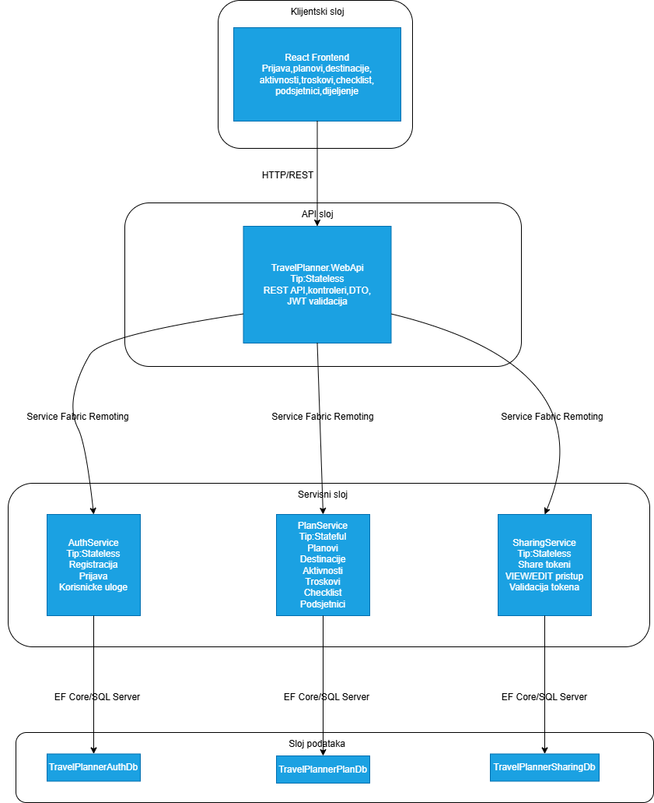
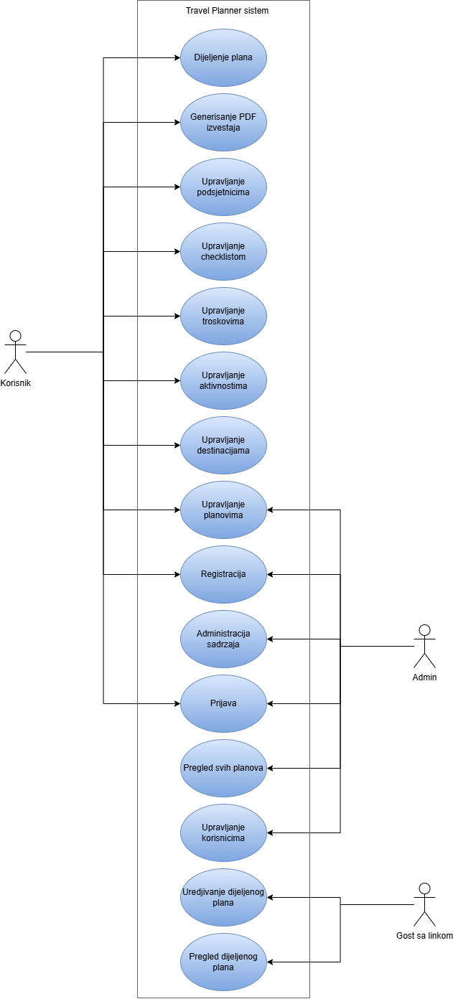

# Travel Planner

Travel Planner is a microservice-based web application for end-to-end travel planning. The system allows users to create travel plans, manage destinations, organize daily activities, track expenses and budget, maintain a checklist and reminders, generate PDF reports, and share plans through links or QR codes.

## Table of Contents

- [Project Overview](#project-overview)
- [Main Features](#main-features)
- [System Architecture](#system-architecture)
- [Technologies](#technologies)
- [Prerequisites](#prerequisites)
- [Repository Structure](#repository-structure)
- [Clone the Repository](#clone-the-repository)
- [Database Setup](#database-setup)
- [Configuration](#configuration)
- [Running the Backend](#running-the-backend)
- [Running the Frontend](#running-the-frontend)
- [Running the Full System](#running-the-full-system)
- [Useful URLs](#useful-urls)
- [Admin Account](#admin-account)
- [Migrations](#migrations)
- [Documentation and Diagrams](#documentation-and-diagrams)
- [Troubleshooting](#troubleshooting)

## Project Overview

The system is split into:

- a React frontend application
- a `TravelPlanner.WebApi` gateway / API layer
- an `AuthService` microservice
- a `PlanService` microservice
- a `SharingService` microservice
- 3 separate SQL Server databases

The frontend communicates with the Web API through HTTP/REST requests. The Web API forwards requests to the backend microservices by using Service Fabric Remoting. Each service uses its own SQL Server database through Entity Framework Core.

## Main Features

- user registration and login
- user roles: regular user and admin
- create, view, edit, and delete travel plans
- manage destinations inside a travel plan
- organize activities by day with a calendar view
- manage expenses, categories, and planned budget
- checklist / packing list
- reminders
- generate PDF reports
- share travel plans through links and QR codes
- `VIEW` and `EDIT` access for shared plans
- user and system content administration

## System Architecture



## Use Case Diagram



## Technologies

### Frontend

- React 19
- Vite 8
- React Router DOM 7
- Tailwind CSS 4

### Backend

- .NET 8
- ASP.NET Core
- Microsoft Service Fabric
- Entity Framework Core 8
- JWT authentication
- BCrypt password hashing

### Database

- Microsoft SQL Server / SQL Server Express

## Prerequisites

To run the project locally, make sure you have the following installed:

### Required

- `Git`
- `Node.js`
  - recommended: **Node.js 22 LTS**
- `npm`
  - included with Node.js
- `.NET 8 SDK`
- `Microsoft SQL Server`
  - recommended: **SQL Server Express** or **SQL Server Developer**
- `SQL Server Management Studio (SSMS)`

### Required for the backend and Service Fabric environment

- `Visual Studio 2022`
  - recommended: latest stable update
- workload:
  - `ASP.NET and web development`
- `Service Fabric SDK`
- `Service Fabric Runtime`
- `Service Fabric Tools for Visual Studio`
- local `Service Fabric Local Cluster Manager`

### Note

The backend is not a single ASP.NET Core application started through `dotnet run`. It is a **Service Fabric application**, so the recommended way to run it is through **Visual Studio** with a local Service Fabric cluster.

## Repository Structure

```text
PUGSprojekat/
├── backend/
│   └── TravelPlanner/
│       ├── TravelPlanner.sln
│       ├── TravelPlanner/                  # Service Fabric application (.sfproj)
│       ├── TravelPlanner.WebApi/
│       ├── TravelPlanner.AuthService/
│       ├── TravelPlanner.PlanService/
│       ├── TravelPlanner.SharingService/
│       ├── TravelPlanner.Infrastructure/
│       └── TravelPlanner.Common/
├── frontend/
│   └── travel-planner/
├── docs/
│   └── diagrams/
├── NuGet.Config
└── README.md
```

## Clone the Repository

Clone the repository:

```powershell
git clone <REPOSITORY_URL>
cd PUGSprojekat
```

If you are using a hosted Git repository, for example:

```powershell
git clone https://github.com/<organization-or-user>/<repo>.git
cd PUGSprojekat
```

## Database Setup

The project uses 3 databases:

- `TravelPlannerAuthDb`
- `TravelPlannerPlanDb`
- `TravelPlannerSharingDb`

### Important note

The Web API tries to apply EF migrations at startup. If the SQL account used by the application does not have permission to create databases automatically, it is recommended to create the databases manually before the first run.

### 1. Create the databases

Run the following in `SSMS`:

```sql
CREATE DATABASE TravelPlannerAuthDb;
GO

CREATE DATABASE TravelPlannerPlanDb;
GO

CREATE DATABASE TravelPlannerSharingDb;
GO
```

### 2. Grant access to `NETWORK SERVICE`

Since Service Fabric often runs local processes through `NT AUTHORITY\NETWORK SERVICE`, it is recommended to grant this account access to the databases.

Run in `SSMS`:

```sql
USE [master];
GO

IF NOT EXISTS (
    SELECT 1
    FROM sys.server_principals
    WHERE name = N'NT AUTHORITY\NETWORK SERVICE'
)
BEGIN
    CREATE LOGIN [NT AUTHORITY\NETWORK SERVICE] FROM WINDOWS;
END
GO
```

Then run the following for each database:

```sql
USE [TravelPlannerAuthDb];
GO

IF NOT EXISTS (
    SELECT 1
    FROM sys.database_principals
    WHERE name = N'NT AUTHORITY\NETWORK SERVICE'
)
BEGIN
    CREATE USER [NT AUTHORITY\NETWORK SERVICE] FOR LOGIN [NT AUTHORITY\NETWORK SERVICE];
END
GO

ALTER ROLE db_owner ADD MEMBER [NT AUTHORITY\NETWORK SERVICE];
GO
```

```sql
USE [TravelPlannerPlanDb];
GO

IF NOT EXISTS (
    SELECT 1
    FROM sys.database_principals
    WHERE name = N'NT AUTHORITY\NETWORK SERVICE'
)
BEGIN
    CREATE USER [NT AUTHORITY\NETWORK SERVICE] FOR LOGIN [NT AUTHORITY\NETWORK SERVICE];
END
GO

ALTER ROLE db_owner ADD MEMBER [NT AUTHORITY\NETWORK SERVICE];
GO
```

```sql
USE [TravelPlannerSharingDb];
GO

IF NOT EXISTS (
    SELECT 1
    FROM sys.database_principals
    WHERE name = N'NT AUTHORITY\NETWORK SERVICE'
)
BEGIN
    CREATE USER [NT AUTHORITY\NETWORK SERVICE] FOR LOGIN [NT AUTHORITY\NETWORK SERVICE];
END
GO

ALTER ROLE db_owner ADD MEMBER [NT AUTHORITY\NETWORK SERVICE];
GO
```

### 3. Migrations

Migrations exist and are separated by context:

- `Auth`
- `Plan`
- `Sharing`

When the Web API starts, it attempts to apply migrations automatically through `Database.Migrate()`.

## Configuration

### Frontend `.env`

The frontend uses:

- [frontend/travel-planner/.env](frontend/travel-planner/.env)

Current value:

```env
VITE_API_BASE_URL=http://localhost:8860/api
```

If you change the Web API port, update this value as well.

### Backend connection strings

Check and adjust the connection strings if necessary in:

- [backend/TravelPlanner/TravelPlanner.WebApi/appsettings.json](backend/TravelPlanner/TravelPlanner.WebApi/appsettings.json)
- [backend/TravelPlanner/TravelPlanner.AuthService/appsettings.json](backend/TravelPlanner/TravelPlanner.AuthService/appsettings.json)
- [backend/TravelPlanner/TravelPlanner.PlanService/appsettings.json](backend/TravelPlanner/TravelPlanner.PlanService/appsettings.json)
- [backend/TravelPlanner/TravelPlanner.SharingService/appsettings.json](backend/TravelPlanner/TravelPlanner.SharingService/appsettings.json)

Default databases:

- `TravelPlannerAuthDb`
- `TravelPlannerPlanDb`
- `TravelPlannerSharingDb`

### JWT and admin seed

The Web API configuration contains:

- JWT key
- issuer
- audience
- seeded admin account

This is configured in:

- [backend/TravelPlanner/TravelPlanner.WebApi/appsettings.json](backend/TravelPlanner/TravelPlanner.WebApi/appsettings.json)

## Running the Backend

### Recommended approach: Visual Studio + Service Fabric

1. Open the solution:

```text
backend/TravelPlanner/TravelPlanner.sln
```

2. Wait for NuGet restore to complete in Visual Studio.

3. Make sure the local Service Fabric cluster is running.

4. Set the startup project to:

```text
TravelPlanner
```

This is the **Service Fabric Application project**:

- [backend/TravelPlanner/TravelPlanner/TravelPlanner.sfproj](backend/TravelPlanner/TravelPlanner/TravelPlanner.sfproj)

This is the main backend startup project.

5. Start debugging (`F5`) or start without debugging.

6. Wait for the following services to start:

- `TravelPlanner.WebApi`
- `TravelPlanner.AuthService`
- `TravelPlanner.PlanService`
- `TravelPlanner.SharingService`

7. Once the backend is running, Swagger is available at:

```text
http://localhost:8860/swagger
```

### Port note

Port `8860` is defined in:

- [backend/TravelPlanner/TravelPlanner.WebApi/PackageRoot/ServiceManifest.xml](backend/TravelPlanner/TravelPlanner.WebApi/PackageRoot/ServiceManifest.xml)

## Running the Frontend

Open a new terminal and go to the frontend folder:

```powershell
cd E:\PUGSprojekat\frontend\travel-planner
```

Install dependencies:

```powershell
npm install
```

Start the development server:

```powershell
npm run dev
```

The frontend is available by default at:

```text
http://localhost:5173
```

## Running the Full System

Recommended order:

1. Start SQL Server.
2. Make sure the 3 databases exist.
3. Start the local Service Fabric cluster.
4. Open `TravelPlanner.sln` in Visual Studio.
5. Set `TravelPlanner` as the startup project.
6. Start the backend.
7. Verify `http://localhost:8860/swagger`.
8. In a terminal, start the frontend:

```powershell
cd E:\PUGSprojekat\frontend\travel-planner
npm install
npm run dev
```

9. Open the frontend:

```text
http://localhost:5173
```

## Useful URLs

- Frontend: [http://localhost:5173](http://localhost:5173)
- Swagger: [http://localhost:8860/swagger](http://localhost:8860/swagger)
- API base URL: `http://localhost:8860/api`

## Admin Account

The Web API seeds an admin account at startup from `appsettings.json`:

- email: `admin@travelplanner.com`
- password: `Admin123!`

If the user already exists, the application upgrades that user to the admin role.

## Migrations

Migrations are located in:

- [backend/TravelPlanner/TravelPlanner.Infrastructure/Migrations/Auth](backend/TravelPlanner/TravelPlanner.Infrastructure/Migrations/Auth)
- [backend/TravelPlanner/TravelPlanner.Infrastructure/Migrations/Plan](backend/TravelPlanner/TravelPlanner.Infrastructure/Migrations/Plan)
- [backend/TravelPlanner/TravelPlanner.Infrastructure/Migrations/Sharing](backend/TravelPlanner/TravelPlanner.Infrastructure/Migrations/Sharing)

If you want to verify the backend build manually:

```powershell
cd E:\PUGSprojekat\backend\TravelPlanner
dotnet build TravelPlanner.sln
```

If you want to verify the frontend build manually:

```powershell
cd E:\PUGSprojekat\frontend\travel-planner
npm run build
```

## Documentation and Diagrams

Documentation is stored in:

- [docs](docs)

Diagrams:

- [docs/diagrams/ArhitekturaSistema.png](docs/diagrams/ArhitekturaSistema.png)
- [docs/diagrams/UseCaseDiagram.png](docs/diagrams/UseCaseDiagram.png)


```text
docs/
└── diagrams/
    ├── ArhitekturaSistema.png
    ├── UseCaseDiagram.png

```

## Troubleshooting

### 1. Swagger does not open

Check:

- whether `TravelPlanner` is the startup project
- whether the Service Fabric cluster is running
- whether the backend actually started
- whether port `8860` is already in use

### 2. `CREATE DATABASE permission denied`

This means the SQL account does not have permission to create databases automatically. Fix:

- create the databases manually in SSMS
- or use a SQL account with `CREATE DATABASE` permission

### 3. `Login failed for user 'NT AUTHORITY\\NETWORK SERVICE'`

You need to grant database access to the `NETWORK SERVICE` account. Use the SQL scripts from the [Database Setup](#database-setup) section.

### 4. `Invalid object name ...`

This usually means migrations were not applied or the database schema is incomplete. Check:

- whether the database exists
- whether the Web API successfully runs `Database.Migrate()`
- whether the connection string points to the correct database

### 5. Frontend cannot reach the backend

Check:

- whether the backend is running on `http://localhost:8860`
- whether `.env` contains the correct `VITE_API_BASE_URL`
- whether the frontend is running on `http://localhost:5173`

### 6. Service Fabric packages are missing

If Visual Studio reports a problem with `Microsoft.VisualStudio.Azure.Fabric.MSBuild`:

- run `Restore NuGet Packages`
- verify that the Service Fabric SDK is installed correctly
- restart Visual Studio if necessary

## Notes

- [NuGet.Config](NuGet.Config) is intentionally versioned and should remain in the repository.
- the `docs` folder is intended for architecture, use case diagrams, and additional project documentation.
